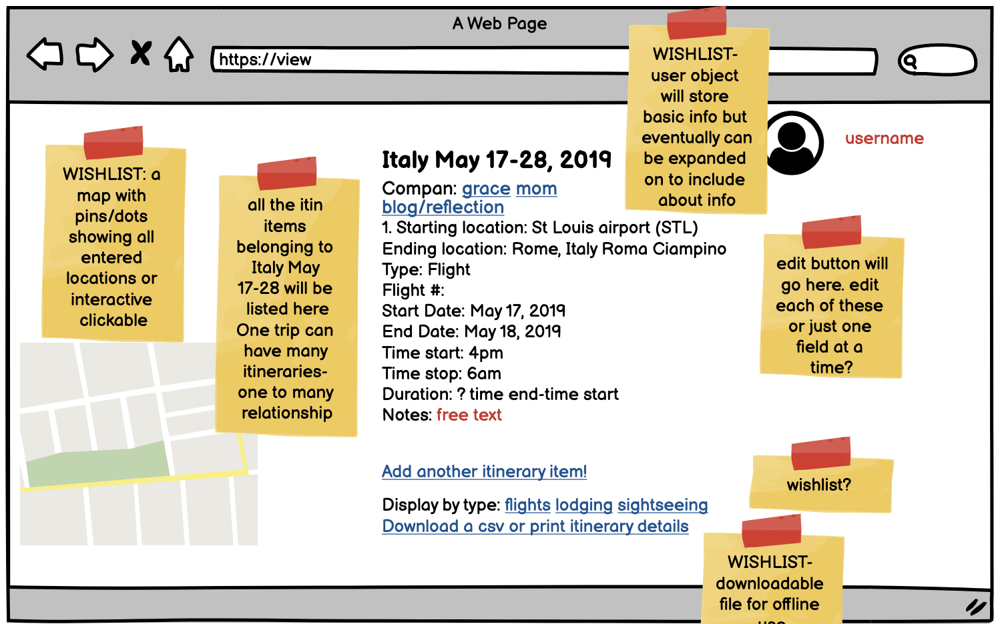

# DestinationMVP_LO
Destination Unknown: This app helps people create structured data/information as they are planning travel experiences. is a LiftOff Project completed as part of LC101.

## Build status

Build status is in progress. Some user stories have been implemented.

## Features

Create user account and log in
Search by keyword
Edit trip data
Organize by overarching trip detail (Italy trip, Romania trip...) or by type (Italy trip; hotels OR Italy trip; sightseeing)
View or interact with a map
Integrate with calendar tools
Create post or tags (free text posts about things they liked/didn’t like)

##Technologies

This software applications uses the following stack:
Java
Spring Boot
Hibernate
MySQL (possibly postGres)
Thymeleaf templates (javascript)
Leaflet.js

## Wireframes
  
  - Home Page
  
  
  - Welcome User
  

  - View Destinations
  
  
  - Create New Destination
  
  
  - Create New Itinerary Item
  

## Credits
LC101, FOSS4g,

## License
GPA free and open source license; any code derived from this should remain open source.

GPL 3.0-or-Later © Yourname